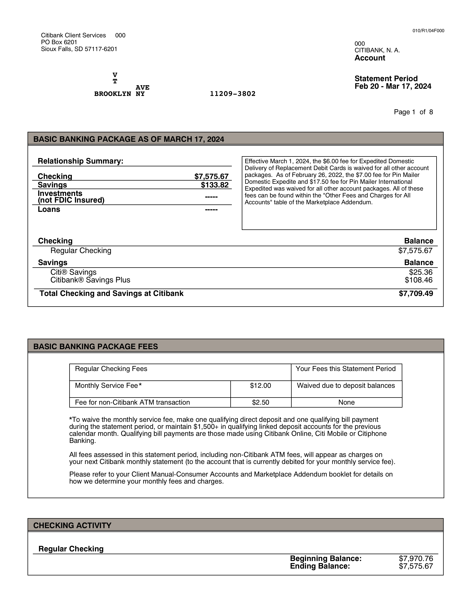

# Bank Account with Two Names

When reviewing tenant applications, I am sometimes confronted two names on a bank account. The redacted first page of the statement is below. Can anyone tell me who owns this bank account? Is it V and T? Is it a convenience account? What am I looking at?

I didn't remove anything other than the names [but left one letter], account number, and address.

In other areas of our law, two names means something. For bank accounts, it can mean several things. That's just mean to a person who has to interpret it. Did convenience accounts create this ambiguity? Is our proposed bank legislation going to help in a scenario like this or is it going to create more confusion? 

{height: "50%"}
 

