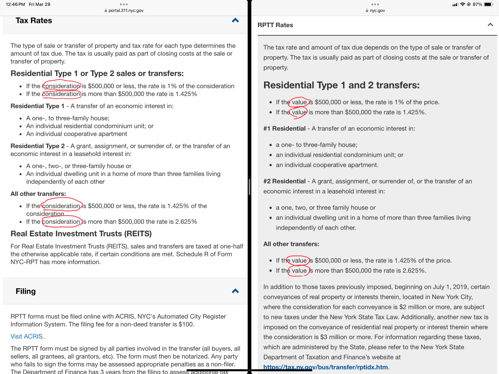

## Is a New York State or New York City transfer tax imposed on gifts of membership interests of a limited liability company that owns New York real property? 

Here is the problem: 

It depends on whether there is a mortgage. 

There is no transfer tax both at the state and city (NYC) level when the transfer is a gift of LLC membership interests, the LLC owns NYC real property, and there is no mortgage on the property. 20 NYCRR §575.9(c)(4); 9 RCNY § 23-03(j)(1). 

<!-- I was part of an extensive discussion in March 31, 2023 on the NYSBA RE listserv. -->